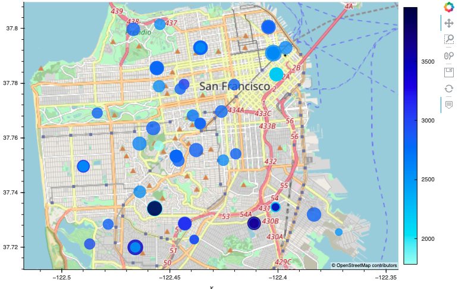

# Housing_rental_market_analysis_for_San_Francisco

The main objective of this project is to visualize and analyze the real estate data in San Francisco. The following tasks are performed:

* Calculate and plot the housing units per year.
* Calculate and plot the average prices per square foot.
* Compare the average prices by neighborhood.
* Build an interactive neighborhood map.
* Compose a data story.

## Technologies Used
The following technologies were used in this repository:
* `Python 3.9.13` - This project was developed using Python programming language version 3.9.13. 
* `JupyterLab` - This web-based interactive development environment was used for exploring and analyzing data.
* `pandas`- Package used for data manipulation and analysis. 
* `hvplot` - Package used for interactive data visualization in Python.
* `pathlib` - Package provides a simple interface to manipulate file system paths in an object-oriented manner.
* 

## Installation
1. Install the Conda package manager on your local machine, following the instructions for your operating system on the official[Conda website](https://docs.conda.io/projects/conda/en/latest/user-guide/install/).
2. Clone the repository to your local machine using the following command:
```
git clone https://github.com/Xipilscode/Housing_rental_market_analysis

```
3. Create a new Conda environment for the project, and activate it. You can do this by running the following commands in your terminal:
```
conda create --name myenv
conda activate myenv
```
4. Install the required dependencies using Conda and pip. You can do this by running the following commands in your terminal:
```
conda install pandas
conda install hvplot
pip install geoviews
```
5. Verify that the installations were successful by running the following commands in your terminal:
```
conda list pandas
conda list hvplot
conda list geoviews
```
6. Run the Jupyter Notebook file **san_francisco_housing.ipynb** to use the project

## Instructions
Use the `san_francisco_housing.ipynb` notebook to visualize and analyze the real-estate data.
This project will create a visualization by using hvPlot and GeoViews. Additionally, you need to read the `sfo_neighborhoods_census_data.csv` file from the Resources folder into the notebook and create the DataFrame that will be used in the analysis.

The main task is to visualize and analyze the real-estate data in. Use the `san_francisco_housing.ipynb` notebook to complete the following tasks:

* Calculate and plot the housing units per year.

* Calculate and plot the average prices per square foot.

* Compare the average prices by neighborhood.

* Build an interactive neighborhood map.

* Compose data story.

### Calculate and Plot the Housing Units per Year
For this project section, we will use numerical and visual aggregation to calculate the count of housing units per year and display the results as a bar chart. To accomplish this, please follow the steps below:

1. Use the `groupby()` function to group the data by year. Aggregate the results by the `mean()` of the groups.

2. Use the `hvplot` function to plot the `housing_units_by_year` DataFrame as a bar chart. The x-axis represent the `year` and the y-axis represent the housing_units.

3. Style and format the line plot to ensure a professionally styled visualization. The  resulting plot will appear similar to the following image:


4. Answer the following question: What’s the overall trend in housing units over the period that you’re analyzing?

### Calculate and Plot the Average Sale Prices per Square Foot
For this project section, we will use numerical and visual aggregation to calculate the average prices per square foot, and then visualize the results as a bar chart. To accomplish this, please follow the steps below:

1. Group the data by year, and then average the results to see what is the lowest gross rent that’s reported for the years that the DataFrame includes?

2. Create a new DataFrame named `prices_square_foot_by_year` by filtering out the “housing_units” column. The new DataFrame should include the averages per year for only the sale price per square foot and the gross rent.

3. Use hvPlot to plot the `prices_square_foot_by_year` DataFrame as a line plot. the resulting plot will appear similar to the following image. 


4. Use both the `prices_square_foot_by_year` DataFrame and interactive plots to answer the following questions:

* Did any year experience a drop in the average sale price per square foot compared to the previous year?

* If so, did the gross rent increase or decrease during that year?

### Compare the Average Sale Prices by Neighborhood
For this project section, we will use interactive visualizations and widgets to explore the average sale price per square foot by neighborhood. To accomplish this, please follow the steps below:

1. Create a new DataFrame that groups the original DataFrame by year and neighborhood. Aggregate the results by the `mean()` of the groups.

2. Filter out the “housing_units” column to create a DataFrame that includes only the `sale_price_sqr_foot` and `gross_rent averages` per year.

3. Create an interactive line plot with hvPlot that visualizes both `sale_price_sqr_foot` and `gross_rent`. Set the x-axis parameter to the year (x="year"). Use the groupby parameter to create an interactive widget for neighborhood. The resulting plot will appear similar to the following image:


4. Use the interactive visualization to answer the following question:

* For the Anza Vista neighborhood, is the average sale price per square foot for 2016 more or less than the price that’s listed for 2012?

### Build an Interactive Neighborhood Map
For this project section, we will explore the geospatial relationships in the data by using interactive visualizations with hvPlot and GeoViews. To build the map, we'll use the `sfo_data_df` DataFrame (created during the initial import), which includes the neighborhood location data with the average prices. To accomplish this, please follow the steps below:

1. Read the `neighborhood_coordinates.csv` file from the Resources folder into the notebook, and create a DataFrame named `neighborhood_locations_df`. Set the index_col of the DataFrame as “Neighborhood”.

2. Using the original `sfo_data_df` Dataframe, create a DataFrame named `all_neighborhood_info_df` that groups the data by neighborhood. Aggregate the results by the `mean()` of the group.

3. Review the two code cells that concatenate the `neighborhood_locations_df` DataFrame with the `all_neighborhood_info_df` DataFrame. Note that the first cell uses the Pandas concat function to create a DataFrame named `all_neighborhoods_df`. The second cell cleans the data and sets the “Neighborhood” column. We'll run these cells to create the `all_neighborhoods_df` DataFrame, which we’ll need to create the geospatial visualization.

4. Using hvPlot with GeoViews enabled, we'll create a points plot for the all_neighborhoods_df DataFrame. The resulting plot will appear similar to the following image:



5. Use the interactive map to answer the following question:
* Which neighborhood has the highest gross rent, and which has the highest sale price per square foot?

### Compose Your Data Story
Based on the visualizations that created, answer the following questions:

* How does the trend in rental income growth compare to the trend in sales prices? Does this same trend hold true for all the neighborhoods across San Francisco?

* Based on the potential one-click buy-and-rent strategy that you are pursuing, what insights can you draw? Are there any particular neighborhoods that you would recommend for investment?

### Contributors
Alexander Likhachev

### License
MIT